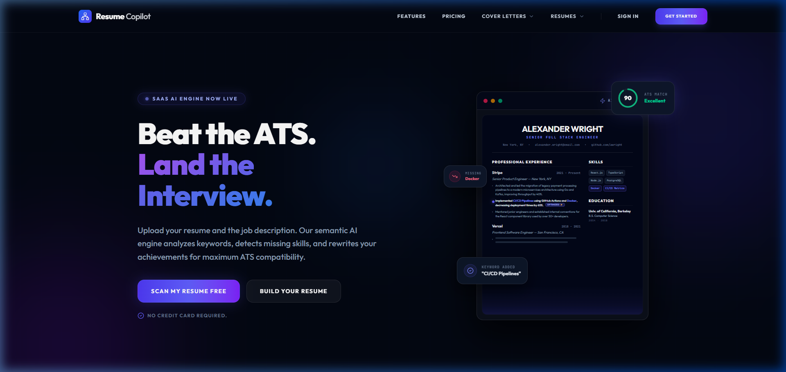
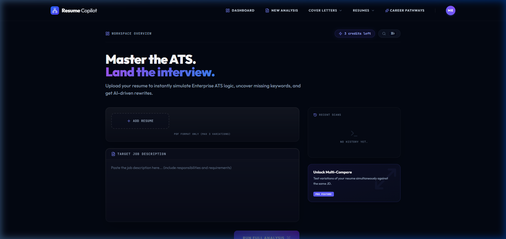
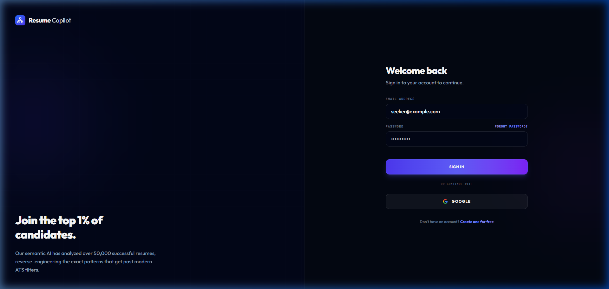
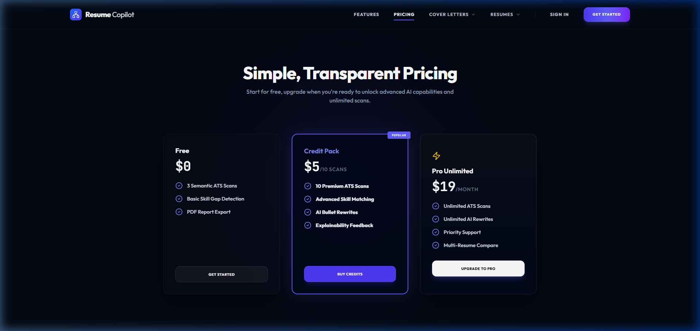

# Resume Copilot AI



Resume Copilot AI is an advanced, automated Resume Parsing, ATS (Applicant Tracking System) Simulation, and Career Hub platform. Built with a React-Vite frontend, an Express-Node backend, and powered by Google's Gemini 2.5 Flash API, the platform evaluates resume readability, flags critical keyword gaps, suggests STAR-formatted bullet rewrites, and renders print-ready PDF layouts.

It now features a comprehensive **Firebase Authentication Suite** (Google, GitHub, and Email/Password), an **Email Verification Gate** (blocking unverified accounts), a **Local User Database** (`users.json`), and a **System Admin Portal** for managing user credit balances.

**Live Demo**: [cvwithcopilot.vercel.app](https://cvwithcopilot.vercel.app)

---

## 📸 Application Gallery

### Landing Workspace


### ATS Scoring Dashboard


### System Admin Portal


### Authentication Interface


### Pro Upgrades & Pricing


---

## 🌟 Core Features

### 🔍 ATS Simulator & AI scoring
* **HR Parsing Simulation**: Simulates how major applicant tracking systems (Workday, Greenhouse, Lever) scan and score your resume structure.
* **Semantic Keyword Matching**: Compiles keywords from target Job Descriptions and audits your resume's experience rows to identify critical vs. optional keyword coverage.
* **AI Bullet Rewrites**: Leverages the STAR method (Situation, Task, Action, Result) to automatically rewrite weak achievements, sprinkling in missing skills naturally.

### ✍️ Professional Editor & Document Exporter
* **Multiple Layout Templates**: Select from Creative, Tech, Academic, and Executive formats.
* **Cover Letter Builder**: Generates tailored, role-specific cover letters matched to the job description and your resume experience, supporting dynamic light/dark theming.
* **High-Fidelity PDF Export**: Downloads clean A4 PDF layouts without page overflows, duplicate blank pages, or SVG baseline overlaps.

### 🔐 Secure Multi-Provider Authentication
* **OAuth Login Support**: Seamlessly authenticate via Google or GitHub popup windows.
* **Email & Password Authentication**: Allows standard credential registration and password changes.
* **Email Verification Gate**: Enforces account activation. Unverified email/password accounts are stopped by a fullscreen lockout gate where they can resend verification links or refresh session states in real-time.
* **Zero-Config Fallback Mode**: Gracefully degrades to local mock sessions if Firebase environment credentials are missing, enabling immediate preview/development testing.

### 🛠️ System Admin Portal
* **User Database**: View a complete, paginated directory of all registered users, their login providers, creation dates, and email verification status.
* **User Credit Manager**: Search users by name/email and dynamically adjust scan credits (`+10 Credits` / `-10 Credits`) to manage access.
* **Local Database Storage**: Automatically synchronizes authenticated user sessions to a local backend storage file (`users.json`) on the fly.

---

## 🛠️ Technology Stack

* **Frontend**: React 18, Vite, TypeScript, Tailwind CSS, Lucide Icons, Framer Motion
* **Backend Runtime**: Node.js, Express (serving proxy endpoints, payment hooks, and SPA routing)
* **Auth & Session Security**: Firebase client SDK v9+
* **AI Engine**: Google Gemini 2.5 Flash SDK (`@google/genai`)
* **Payment Gateway**: Razorpay (including webhooks for credit provisioning)
* **File Processing**: `pdf-parse`, `multer`

---

## 🚀 Installation & Local Setup

### 1. Clone & Install Dependencies
```bash
git clone https://github.com/sabledattatray/Resume-Copilot-AI.git
cd Resume-Copilot-AI
npm install
```

### 2. Configure Environment Variables
Create a `.env` file in the root directory and configure the following keys:

```env
# Server Port (default is 3000)
PORT=3000

# Google Gemini API Key
GEMINI_API_KEY=your_gemini_api_key_here

# Firebase Web App client configuration keys
VITE_FIREBASE_API_KEY=your_firebase_api_key_here
VITE_FIREBASE_AUTH_DOMAIN=your_project_id.firebaseapp.com
VITE_FIREBASE_PROJECT_ID=your_project_id_here
VITE_FIREBASE_STORAGE_BUCKET=your_project_id.appspot.com
VITE_FIREBASE_MESSAGING_SENDER_ID=your_sender_id_here
VITE_FIREBASE_APP_ID=your_app_id_here

# Razorpay credentials (falls back to mock payment if keys are default test keys)
RAZORPAY_KEY_ID=your_razorpay_key_id_here
RAZORPAY_KEY_SECRET=your_razorpay_key_secret_here
RAZORPAY_WEBHOOK_SECRET=your_webhook_secret_here
```

### 3. Setup Firebase Console Sign-In Providers
To enable auth methods for your project:
1. Go to your [Firebase Console](https://console.firebase.google.com/) and navigate to **Authentication** > **Sign-in method**.
2. **Email/Password**: Click Email/Password, toggle **Enable**, and save.
3. **Google**: Click Google, toggle **Enable**, select your support email, and save.
4. **GitHub**:
   - Register a new OAuth App in your [GitHub Developer Settings](https://github.com/settings/developers).
   - Copy the Authorization callback URL from the Firebase GitHub configuration dialog and paste it into GitHub.
   - Paste your GitHub **Client ID** and **Client Secret** back into the Firebase console and click save.

### 4. Run the Application
Start the development backend proxy and React server:
```bash
npm run dev
```
Open **[http://localhost:3000](http://localhost:3000)** in your browser.

*Note: In local development, if you sign up using email/password and do not want to wait for email delivery, a **"Bypass Verification (Local Dev Mode)"** button will appear on the lockout screen to let you instantly activate your test accounts.*

---

## 📦 Production Bundling

To compile a optimized build bundle:
```bash
npm run build
```
This builds static client assets in `/dist` and bundles the Node API runtime to `/dist/server.cjs`.

---

## 👨‍💻 Author

**Built by Datta Sable**  
*AI Systems Architect • SaaS Builder • Web & Automation Developer*

* **GitHub**: [@sabledattatray](https://github.com/sabledattatray)
* **Website**: [dattasable.com](https://dattasable.com)

---

> *"Stop guessing what the ATS wants. Let the AI build it."*
